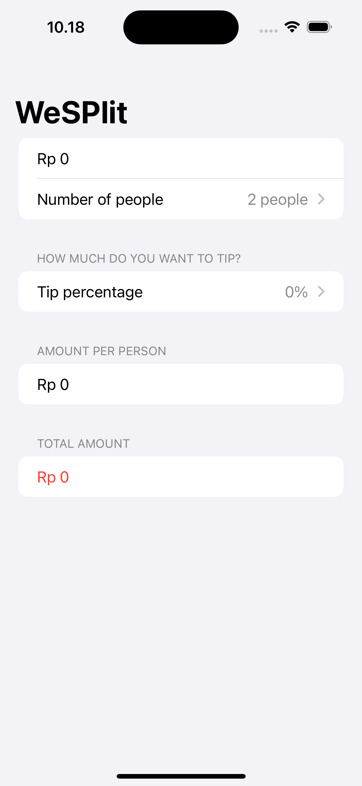

# WeSplit
This is a basic learning project to check-splitting app that you might use after eating at a restaurant – you enter the cost of your food, select how much of a tip you want to leave, and how many people you’re with, and it will tell you how much each person needs to pay.
The source learning is from 1st project of course "100 Days of SwiftUI" (https://www.hackingwithswift.com/100/swiftui)

--
## Goals
1. Display a form to input a total amount you need to pay, number of people that splitting the amount and tips percentage.
2. Show toolbar button to set done updating total amount you need to pay.
3. Can select number of people from 2 to 99 people.
4. Can select percentage of tips from 0% to 100%.
5. Display amount per person and total amount after adding tips percentage

# WeSplit – Image Comments Feature

---

